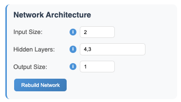
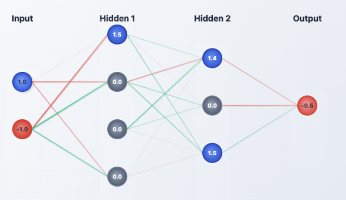
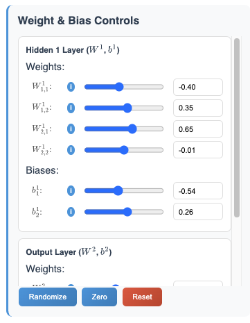
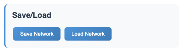

# Designing Networks
All the controls for defining the architecture of the neural network are located on the left side of the application interface. Here, you can specify the number of layers and the number of neurons in each layer.

## Architecture Design
Recall that a feedfoward ReLU neural network consists of a series of linear maps followed by non-linear activation functions (ReLUs).

$$\mathbb{R}^m \longrightarrow \mathbb{R}^{h_1} \longrightarrow \mathbb{R}^{h_2}  \longrightarrow \cdots  \longrightarrow \mathbb{R}^{h_{L-1}} \longrightarrow \mathbb{R}^n$$

The architecture of the network is defined by the number of layers and the number of neurons in each layer, e.g. the above model displays a network of architecture $(h_0 = m, h_1, \dots, h_L, h_{L+1}=n)$. In the below image, we define a network with architecture $(2,4,3,1)$.




## Visualization
Once the architecture is defined, the network visualization will automatically update to reflect the changes. The visualization displays each neuron as a node and each weight as a directed edge between nodes. Edges with positive weights are colored <span style="color: lightgreen;">**green**</span>, while edges with negative weights are colored <span style="color: red;">**red**</span>.

In a similar vein, **active** neurons are represented with a <span style="background-color: #007acc; color: white; padding: 2px 6px; border-radius: 4px; font-weight: bold;">blue</span> filling, while neurons that are "off" (due to reLU activation) are represented with a <span style="background-color:rgb(73, 73, 73); color: white; padding: 2px 6px; border-radius: 4px; font-weight: bold;">gray</span> filling. The reasoning for neuron activation highlighting will be further explained by the polyhedral decomposition.




## Weights and Biases
Once a network has been defined, you can manually adjust the weights and biases of the network by moving the sliders in the "Weights and Biases Controls" panel. All visualizations will update in real-time to reflect the changes made.

Additionally, the buttons "Randomize" and "Reset" can be used to randomly initialize the weights and biases or reset them all to zero, respectively. Randomization will draw values from a uniformly from the interval $[-1,1]$.




## Saving and Loading Models (JSON)


When you save a network, it will be saved as `multilayer_network.json`. The file structure is fairly organized to ease readibility and directly editting, for instance:

```
{
  "architecture": [2, 3, 3, 1],
  "weights": [
    [
      [2, 1],
      [1, -1],
      [-1, -2]
    ],
    [
      [4, 6, 5],
      [1, -2, 1],
      [-1, -4, 1]
    ],
    [
      [0, 0, 0]
    ]
  ],
  "biases": [
    [
      [-2],
      [-1],
      [-2]
    ],
    [
      [-7],
      [3],
      [1]
    ],
    [
      [0]
    ]
  ],
  "data": []
}
```

For comparison, this above network has been implemented [here in Desmos](https://www.desmos.com/calculator/n0pgbjjjbj). Unpacking the collapsed folders, especially in later layers, shows the inherint increasing complexity of the neural networks as they grow deeper and wider.