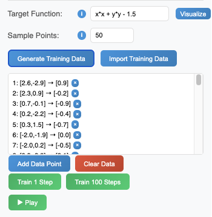
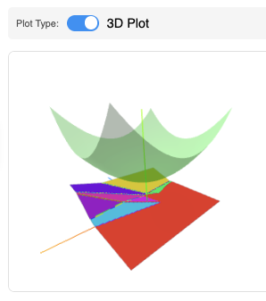
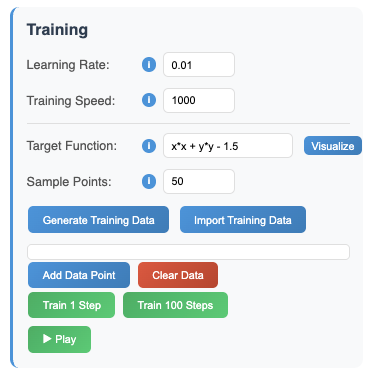
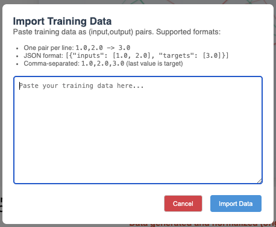
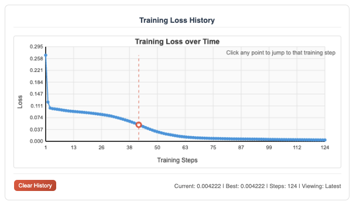

# Training Networks

## Generating Training Data

Once a network architecture has been defined, you can proceed to train the network using the _Training_ panel located on the right side of the interface. Here, you begin by entering the target function that the network will learn to approximate. 

This is a function of two variables, `x` and `y`, which represent the coordinates in the input space.



The full list of supported functions are as follows:
```
x*x                         // x squared
x*x*x                       // x cubed  
Math.pow(x, 3)              // x to the power of 3
Math.sin(x)
Math.cos(y)
Math.tan(x)
Math.abs(x - y)
Math.sqrt(x*x + y*y)
Math.exp(x)
Math.log(x)
Math.log10(x)
Math.floor(x)
Math.ceil(y)
Math.round(x + y)
Math.min(x, y)
Math.max(x, y)
Math.atan2(y, x)
```

## Visualizing Target Functions

After enabling the 3D plot, you can visualize the target function. For example, below the paraboloid 
$$f(x,y) = \frac{1}{5} x^2 + \frac{1}{5}y^2 + \frac{3}{2}$$
is visualized as the translucent surface in the 3D plot:




## Training Parameters

Additionally, there are several parameters and features available to facilitate the training of neural networks.



The **learning rate** parameter controls how quickly the network learns during training. A higher learning rate can speed up training but may lead to instability, while a lower learning rate provides more stable convergence at the cost of longer training times.

The **training speed** applies when hitting the "Play" button to continuously train the network. It determines how many training iterations are performed (measured in milliseconds).

## Importing Training Data

If you have custom training data, you can import it using the _Import Data_ button. The data is importable in various different formats shown at the top of the window.



For instance, the following simple Python script generates binary classification data consisting of points in an inner circle (labeled `0`) and points in an outer annulus (labeled `1`):

```
import random
import math

def annuli(radius1=1, radius2=2, radius3=3, inner_dots=50, outer_dots=100):
    """Generate binary classification data: inner circle (0) and outer annulus (1)"""
    points = []
    
    # Inner circle points (label 0)
    for _ in range(inner_dots):
        r = random.uniform(0, radius1)
        theta = random.uniform(0, 2 * math.pi)
        x = r * math.cos(theta)
        y = r * math.sin(theta)
        points.append({"inputs": [x, y], "targets": [0]})
    
    # Outer annulus points (label 1)
    for _ in range(outer_dots):
        r = random.uniform(radius2, radius3)
        theta = random.uniform(0, 2 * math.pi)
        x = r * math.cos(theta)
        y = r * math.sin(theta)
        points.append({"inputs": [x, y], "targets": [1]})
    
    return points

# Example usage:
data = annuli()
for point in data:
    x, y = point["inputs"]
    target = point["targets"][0]
    print(f"{x:.3f},{y:.3f} -> {target}")
```


## Loss Graph Visualization

While training the network, the _Loss Graph_ at the bottom of the panel visualizes how well the network is learning over time. The **loss value** indicates the difference between the network's predictions and the actual target values. A decreasing loss value signifies that the network is improving its performance.



Additionally, the loss graph allows you to click on any point along the curve to visualize the network's output at that specific training iteration. This feature helps in understanding how the network's predictions evolve during the training process, as well as investigate any interesting behaviors or anomalies that may occur.