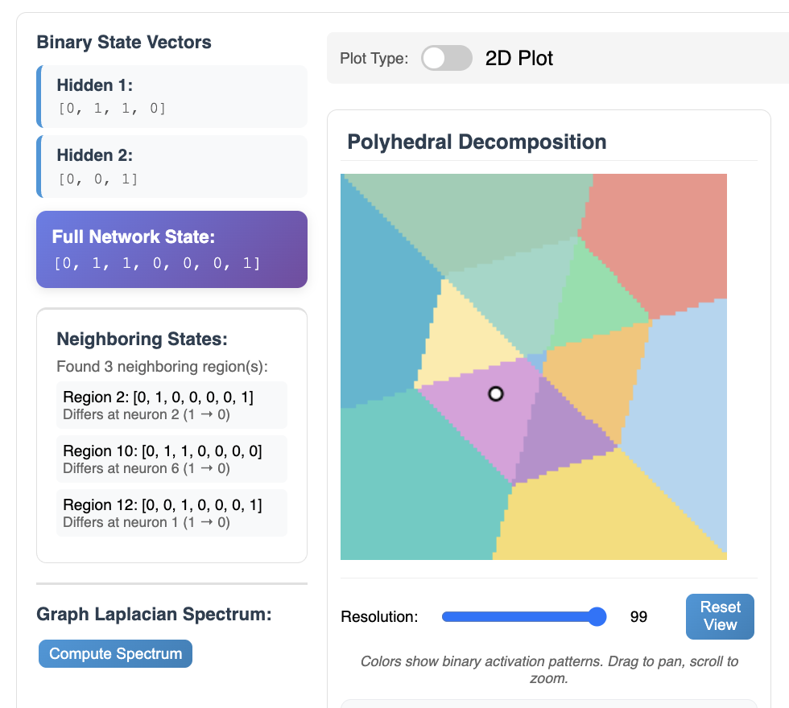
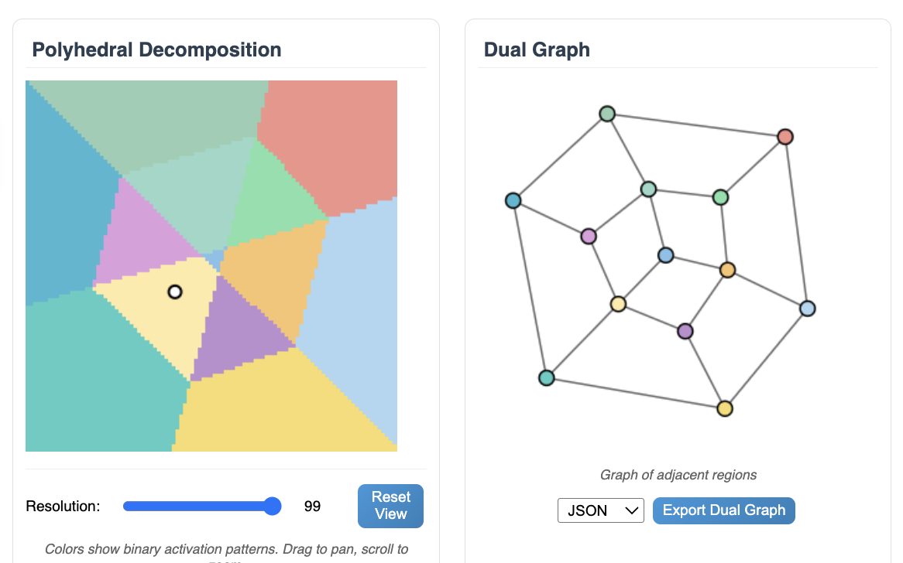
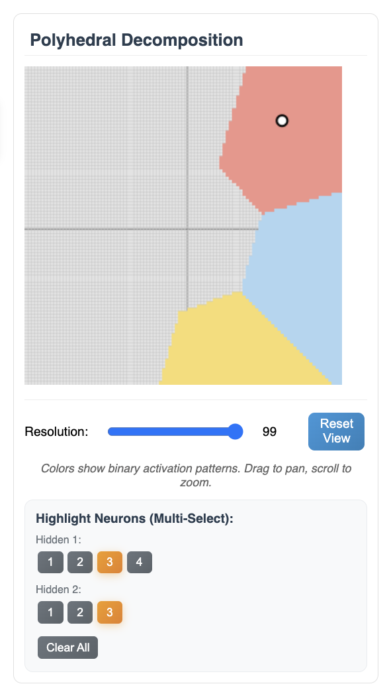

# Polyhedral Decomposition

The polyhedral decomposition view provides a geometric representation of how a trained neural network partitions the input space. Differently colored regions correspond to distinct **binary vectors**, which are a short-hand for denoting which neurons in the hidden layer are active (outputting a value greater than 0) for inputs within that region.

**Clicking** anywhere in the image will adjust the input to the network to correspond to that location in the input space. 

## Dual Graph Representation

To the right of polyhedral decomposition view is the **dual graph** representation of the polyhedral decomposition. Each node in the dual graph corresponds to a region in the polyhedral decomposition, and edges connect nodes whose corresponding regions share a boundary (regions of single Hamming distance away).

**Important note:** The dual graph representation only reflects the regions that are currently visible in the polyhedral decomposition view box. Panning and zooming the view box will update the dual graph.

To the very left, there is additionally an option to compute the eigenvalues of the graph Laplacian of the dual graph. This can be useful for analyzing properties of the neural network, such as connectivity and clustering of regions in the input space.

## Neuron Activation Highlighting

Lastly, directly underneathe the polyhedral view, you may choose to highlight regions where any subset of neurons (in the hidden layer) are active.

